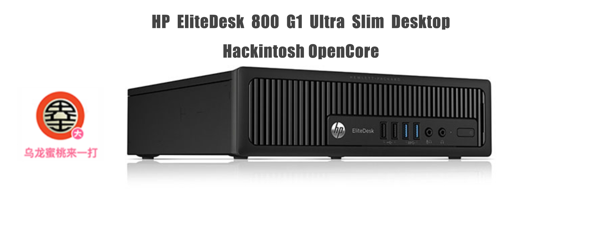
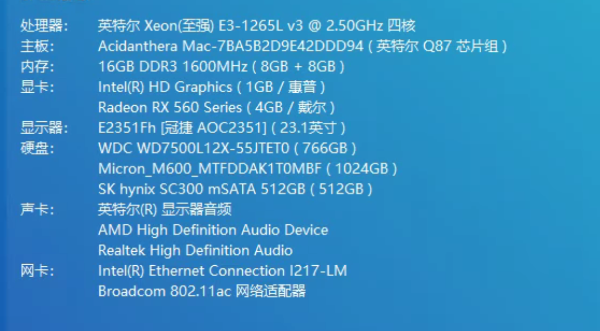

## 惠普 EliteDesk 800 G1 Ultra Slim Desktop 黑苹果 OpenCore EFI



### [ENGLISH](README.EN.md)

### OpenCore

[OpenCore 0.9.7](https://github.com/acidanthera/OpenCorePkg)

### macOS

- macOS Monterey 12.x
- macOS Ventura   13.x 
- macOS Sonoma  14.x 

### 硬件

- 芯片组: Q87
- 处理器: 英特尔志强 E3-1265L v3
- 内存: 8GB*2 DDR3 1600 MHz
- 硬   盘: Micron M600 1TB MacOS Ventura
- 独   显: RX560
- 声卡: 瑞昱 ALC221 
- 有线网卡: 英特尔 L217-LM
- 无线网卡: DW1560

### BIOS设置

```
禁用 Secure Boot
禁用 CSM
禁用 FastBoot
显卡设置为独显

```

### 注意事项

 - 安装成功后必须使用 [OpenCore Configurator](https://mackie100projects.altervista.org/opencore-configurator/) 或者 [OCAuxiliaryTools](https://github.com/ic005k/OCAuxiliaryTools) 生成你自己的 SMBIOS


### 联系我们

QQ群: 23304408


### 鲁大师硬件截图



### 常用工具

- [Hackintool](https://github.com/headkaze/Hackintool) 
- [OCAuxiliaryTools](https://github.com/ic005k/OCAuxiliaryTools) AKA `OCAT`.
- [OpenCore Configurator](https://mackie100projects.altervista.org/opencore-configurator/) AKA `OCC`.
- [gibMacOS](https://github.com/corpnewt/gibMacOS) Build your own MacOS image.
- [ProperTree](https://github.com/corpnewt/ProperTree) Plist editor.